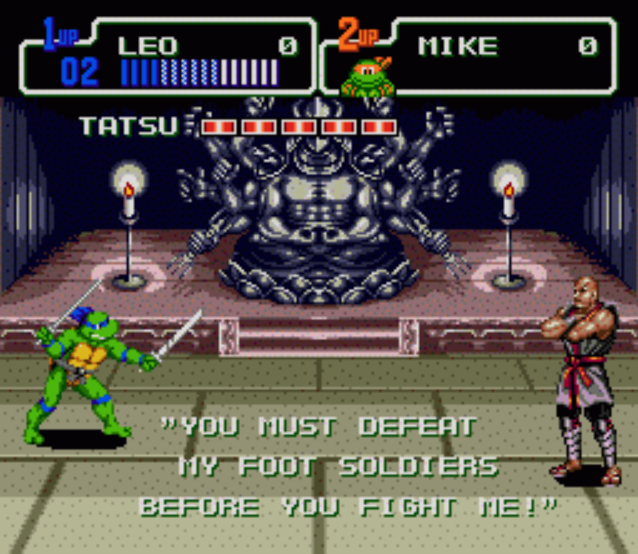

# *Инструкция по работе с GIT для черепашек*

LICENSE: [MIT](/license.md)

 

# **Содержание:**
🐢🥷🔵🐢🥷🔴🐢🥷🟠🐢🥷🟣🐢🥷 

| Команда | Команда | Команда |
|:---|:---|:---|
|1. [git config](gitconfig.md) |7. [git fetch](/git_fetch.md)| 13. [git show](/git_show.md) |
|2. [git init](git_init.md)| 8. [git merge](/git_merge.md) | 14. [git checkout](/git_checkout.md) |
|3. [git add](./add.md)| 9. [git pull](/git_pull.md) | 15. [О Форках - не путать с ворками и орками](/forks.md) |
|4. [git commit](/git_commit.md)| 10. [git push](/git_push.md) | 16. [Рекомендации по оформлению коммитов](/Рекомендации_по_оформленнию_коммитов.md) |
|5. [git clone](/git_clone.md)| 11. [git status](/git_status.md) |
|6. [git remote add](/git_remote_add.md)| 12. [git log](/git_log.md) |

🐢🥷🔵🐢🥷🔴🐢🥷🟠🐢🥷🟣🐢🥷

GIT Logo by Jason long - http://git-scm.com/downloads/logos, license: [CC BY 3.0](https://creativecommons.org/licenses/by/3.0/)

> 🐢 *Персонажи используются с уважением к правообладателям (Nickelodeon/Viacom). Эта неофициальная инструкция создана фанатами для фанатов.*